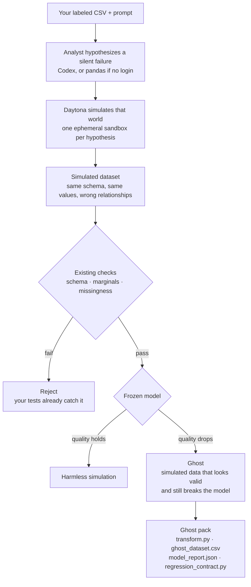

# GhostData

**Find the data-pipeline failure your tests already passed.**

GhostData does not attack the model with noise. It **simulates a failed data world** — for example valid feature values attached to the wrong rows — then asks whether that world would still look fine to your existing checks while the frozen model quietly degrades. If yes, that simulated dataset is a **Ghost**.

Not a drift dashboard. Not Great Expectations. Not an LLM inventing scary stories.

## Architecture

The analyst only hypothesizes the failure. **Daytona simulates the world**: it applies the transform to your real table, materializes the simulated dataset, runs the checks you already trust, and scores the frozen model. Then the sandbox is deleted. The host never invents an AUC.



A Ghost is measured, not narrated: the simulated world must pass the checks **and** drop the frozen-model metric. Several hypotheses can run in parallel; leftover sandboxes should be `0`.

## Quick start

Python 3.11+. Daytona key from [app.daytona.io](https://app.daytona.io) (this demo uses Daytona sandboxes). Codex login is optional.

```bash
python3 -m venv .venv && source .venv/bin/activate
pip install -r requirements.txt
cp .env.example .env          # set DAYTONA_API_KEY; leave DAYTONA_TARGET=eu
python scripts/ensure_snapshot.py
PYTHONPATH=src uvicorn app.backend.main:app --host 127.0.0.1 --port 8000
```

Open [http://127.0.0.1:8000](http://127.0.0.1:8000). Upload a labeled CSV (or pick a fixture) and a one-line task, e.g. `Predict credit default; SeriousDlqin2yrs is the label.` Wait for a Ghost, then download the four artifacts.

Without Codex: `GHOSTDATA_ANALYST=deterministic` in `.env` uses the pandas proposer. With Codex: `codex login` (ChatGPT), then leave `GHOSTDATA_ANALYST=auto`.

## Other commands

```bash
pytest -q
python scripts/demo_local.py
python scripts/run_discovery.py --backend daytona --dataset debug --max-specs 2
python scripts/run_redteam.py --csv data/build/givemesomecredit_debug_3k.csv \
  --prompt "Predict default; SeriousDlqin2yrs is the label."
```

## Layout

| Path | Role |
|---|---|
| `app/` | FastAPI + static UI |
| `src/ghostdata/` | contracts, planner, Daytona/local runners, evaluators |
| `demo/pipeline/` | sandbox worker scripts |
| `data/` | fixtures (credit is a fixture, not the product) |
| `scripts/` | snapshot, demo, discovery, red-team |
