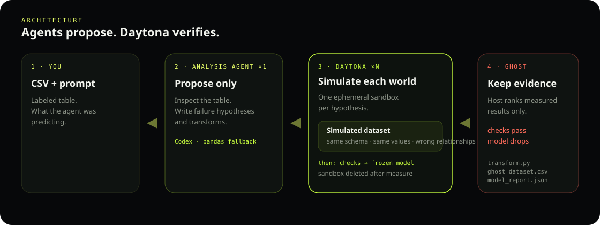

# GhostData

**GhostData verifies data-analysis agents.** They propose. Daytona measures. We keep only falsified counterexamples.

Data agents inspect tables and return claims. GhostData is the **verification layer**: the agent analyzes and writes transforms; **isolated Daytona sandboxes measure those claims**. Credit / entity misalignment / AUC is the first fixture that proves the loop.

A **Ghost** is a measured counterexample: existing checks still pass and the frozen model drops. Only the host evaluator declares one.

## Architecture



The analysis agent writes hypotheses. **Daytona simulates each world** in its own ephemeral sandbox: apply the transform, emit a simulated dataset (same schema, same values, wrong relationships), run existing checks, score the frozen model, then delete the sandbox. The host ranks that measured evidence. Leftover sandboxes should be `0`.

## Ghost pack

A Ghost ships four files. The UI previews each one; download if you want the original.

| File | Role | What you get |
|---|---|---|
| `ghost_dataset.csv` | Dataset | Simulated table Daytona materialized. Same schema, same values, wrong relationships. |
| `model_report.json` | Report | Measured checks, frozen-model AUC before → after, affected rows. |
| `transform.py` | Code | The failure applied to the table. Preview in the UI; full file via download. |
| `regression_contract.py` | Code | Runnable test: original CSV passes, Ghost CSV fails. |

These are the only client artifacts. The page does not paste the whole source into the layout.

## Quick start

Python 3.11+. Daytona key from [app.daytona.io](https://app.daytona.io). Codex login is optional.

```bash
python3 -m venv .venv && source .venv/bin/activate
pip install -r requirements.txt
cp .env.example .env          # set DAYTONA_API_KEY; leave DAYTONA_TARGET=eu
python scripts/ensure_snapshot.py
PYTHONPATH=src uvicorn app.backend.main:app --host 127.0.0.1 --port 8000
```

Open [http://127.0.0.1:8000](http://127.0.0.1:8000). Upload a labeled CSV (or pick a fixture). Say what the agent was predicting, e.g. `Predict credit default; SeriousDlqin2yrs is the label.` If a Ghost is measured, preview the four files on the page, then download.

Without Codex: `GHOSTDATA_ANALYST=deterministic` in `.env`. With Codex: `codex login` (ChatGPT), then `GHOSTDATA_ANALYST=auto`.

## Other commands

```bash
pytest -q
python scripts/demo_local.py
python scripts/run_discovery.py --backend daytona --dataset debug --max-specs 2
python scripts/run_redteam.py --csv data/build/givemesomecredit_debug_3k.csv \
  --prompt "Predict default; SeriousDlqin2yrs is the label."
```

## Layout

| Path | Role |
|---|---|
| `app/` | FastAPI + static UI |
| `src/ghostdata/` | contracts, planner, Daytona/local runners, evaluators |
| `demo/pipeline/` | sandbox worker scripts |
| `data/` | fixtures (credit is a fixture, not the product) |
| `scripts/` | snapshot, demo, discovery, red-team |
