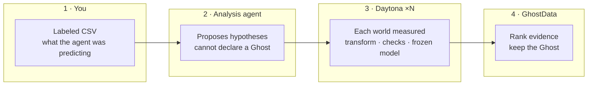

# GhostData

**GhostData verifies data-analysis agents.** They propose. Daytona measures. We keep only falsified counterexamples.

Data agents inspect tables and claim the data is fine. We do not trust that. GhostData is the **verification layer**: the agent may analyze and write transforms; **truth is measured in isolated Daytona sandboxes**. Credit / entity misalignment / AUC is the first fixture that proves the loop, not the product.

A **Ghost** is a measured counterexample: existing checks still pass, the frozen model drops. The agent is not allowed to declare one.

## Architecture

```text
CSV + prompt  (what was the agent predicting?)
    → Analysis agent  (×1, isolated): inspect + propose hypotheses only
    → Verifiers       (Daytona ×N):   transform → checks → frozen model
    → Host evaluator: rank measured evidence → Ghost pack, or nothing
```



Analysts propose. Verifier sandboxes measure. The host evaluator ranks. Codex (or a pandas fallback) is the proposer; it must not claim AUC dropped. Each hypothesis gets its own ephemeral Daytona verifier. Leftover sandboxes should be `0`.

Ghost pack: `transform.py` · `ghost_dataset.csv` · `model_report.json` · `regression_contract.py`

## Quick start

Python 3.11+. Daytona key from [app.daytona.io](https://app.daytona.io). Codex login is optional.

```bash
python3 -m venv .venv && source .venv/bin/activate
pip install -r requirements.txt
cp .env.example .env          # set DAYTONA_API_KEY; leave DAYTONA_TARGET=eu
python scripts/ensure_snapshot.py
PYTHONPATH=src uvicorn app.backend.main:app --host 127.0.0.1 --port 8000
```

Open [http://127.0.0.1:8000](http://127.0.0.1:8000). Upload a labeled CSV (or pick a fixture). Say what the agent was predicting, e.g. `Predict credit default; SeriousDlqin2yrs is the label.` If a Ghost is measured, download the four artifacts.

Without Codex: `GHOSTDATA_ANALYST=deterministic` in `.env`. With Codex: `codex login` (ChatGPT), then `GHOSTDATA_ANALYST=auto`.

## Other commands

```bash
pytest -q
python scripts/demo_local.py
python scripts/run_discovery.py --backend daytona --dataset debug --max-specs 2
python scripts/run_redteam.py --csv data/build/givemesomecredit_debug_3k.csv \
  --prompt "Predict default; SeriousDlqin2yrs is the label."
```

## Layout

| Path | Role |
|---|---|
| `app/` | FastAPI + static UI |
| `src/ghostdata/` | contracts, planner, Daytona/local runners, evaluators |
| `demo/pipeline/` | sandbox worker scripts |
| `data/` | fixtures (credit is a fixture, not the product) |
| `scripts/` | snapshot, demo, discovery, red-team |
